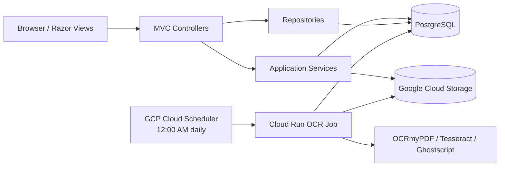

# DMS Developer Handover Guide

| Item | Value |
| --- | --- |
| System | Document Management System (DMS) |
| Application version | 7.2.0 |
| Technology | ASP.NET Core MVC (.NET 10), EF Core, PostgreSQL, Google Cloud Storage |
| Intended audience | Developers and MIS support personnel |
| Last updated | 2026-09-04 |

## 1. Purpose and scope

The DMS stores, classifies, searches, transfers, downloads, and retires company PDF documents. PostgreSQL stores users, document metadata, classifications, access assignments, OCR state, and activity logs. The PDF files are stored separately in Google Cloud Storage.

This guide is a technical handover, not an end-user manual. It explains how to run the application, where responsibilities are located, and which workflows require care when making changes.

## 2. System overview



The application is server-rendered ASP.NET Core MVC. `Program.cs` registers EF Core, session state, services, Serilog, maintenance middleware, routes, and the OCR execution mode.

The main source areas are:

| Folder | Responsibility |
| --- | --- |
| `Controllers/` | HTTP actions, request validation, access decisions, and view selection |
| `Service/` | Access rules, queries, search, storage workflows, PDF validation, OCR, and middleware |
| `Repository/` | Existing user and report data-access helpers |
| `Data/` | EF Core context and startup data seeding |
| `Models/` | Database entities and view models |
| `Views/` | Razor pages and client-side behavior |
| `Migrations/` | PostgreSQL schema history and indexes |
| `Utility/` | Constants, extensions, and shared helpers |

For new behavior, keep request handling in controllers and non-trivial business or storage logic in services. Use EF Core directly or the existing repository classes; do not add another generic repository layer.

## 3. Local setup

### Prerequisites

- .NET 10 SDK
- PostgreSQL
- Access to the development Google Cloud Storage bucket
- A Google service-account JSON file for local storage access
- For local OCR work: Python 3, OCRmyPDF, Tesseract, Ghostscript, and qpdf

Never commit connection strings, service-account files, passwords, or other credentials.

### Configuration

The project supports .NET User Secrets. From the repository root, configure development values using placeholders supplied by the system owner:

```powershell
dotnet user-secrets set "ConnectionStrings:DefaultConnection" "<PostgreSQL connection string>"
dotnet user-secrets set "GoogleCloudStorage:BucketName" "<development bucket>"
dotnet user-secrets set "GoogleCloudStorage:CredentialPath" "<absolute path to service-account JSON>"
```

Important configuration sections:

| Key | Purpose |
| --- | --- |
| `ConnectionStrings:DefaultConnection` | PostgreSQL application database |
| `GoogleCloudStorage:BucketName` | Bucket containing document objects and production data-protection keys |
| `GoogleCloudStorage:CredentialPath` | Local-only service-account file path |
| `LocalOcr:*` | OCR command, language, timeout, and executable paths |
| `OcrWorker:Enabled` | Enables registration of the web-hosted worker |
| `OcrWorker:ExecutionMode` | `Web` for the web process or `Job` for one batch followed by exit |
| `OcrWorker:MaxDocumentsPerRun` | Maximum documents processed by one job execution |

Production uses Application Default Credentials and obtains the database connection string from Secret Manager. Keep environment-specific values outside source control whenever possible.

### Database and application startup

```powershell
dotnet restore
dotnet ef database update
dotnet build
dotnet run
```

The development launch URLs are `https://localhost:7198` and `http://localhost:5275`. Verify the application at `/health`; a successful response is `Healthy`.

`ApplicationDbSeeder` runs during startup and creates a bootstrap administrator if its configured username is absent. Before creating a new shared or production environment, review the seeder and replace or remove bootstrap credentials. Do not circulate the bootstrap password in documentation or chat.

## 4. Core document workflow

The primary entry point is `DmsController`. Storage operations are delegated to `DocumentStorageWorkflowService`, PDF checks to `PdfUploadValidationService`, access decisions to `DmsAccessService`, and OCR to `DocumentOcrService`.

### Upload

1. Only an authenticated Admin or Uploader can open and submit the upload form.
2. Company, year, department, category, box number, submitter, submission date, and PDF are collected.
3. The PDF is limited to 20 MB and checked by extension, content type, PDF header, parseability, and page count.
4. Duplicate original filenames are rejected.
5. The PDF is uploaded to Google Cloud Storage under:

   ```text
   Files/{Company}/{Year}/{Department}/{Category}/{SubCategory?}/{StoredFileName}
   ```

6. Metadata and an activity log are saved to PostgreSQL.
7. OCR state is set to `Pending`. The document remains pending until the scheduled GCP OCR job runs at 12:00 AM each day.

The database transaction cannot roll back a completed cloud upload. When changing this workflow, include compensation or cleanup for failures that occur after storage succeeds.

### OCR and document-text search

OCR states are `NotRequested`, `Pending`, `Processing`, `Completed`, and `Failed`. The OCR service downloads the PDF, extracts text, and saves it in `FileDocument.ExtractedText`. Processing records older than 30 minutes can be claimed again as stale.

Production processes OCR through the Cloud Run job defined in `cloudbuild.ocr-job.yaml`. GCP Cloud Scheduler starts this job once each day at 12:00 AM, using the timezone configured in the scheduler. The schedule is managed in GCP and is not declared in this repository. A PDF uploaded after that run normally remains `Pending` until the following day's run. Metadata search is available immediately, but document-text search cannot find the PDF until OCR completes.

The web deployment disables OCR processing. Although a web background service is registered when configured, its processing loop is currently inactive; do not assume that running the web application processes the OCR queue.

General search has two modes:

- Metadata search covers filename, description, box number, classification, uploader, and submitter.
- Document-text search checks OCR-extracted text and can also be selected with an `ocr:` or `content:` prefix.

Search results exclude soft-deleted documents and are filtered by the current user's permitted companies and departments.

### Edit, transfer, download, and deletion

- Editing metadata does not move the object.
- Replacing a PDF deletes the previous object, uploads the replacement, updates page count, and returns OCR to `Pending`.
- Transferring copies the object to the new computed path, deletes the old object, and then updates the database. Transfer to the current path is rejected.
- Normal download redirects to a signed Google Cloud Storage URL valid for five minutes. A direct-download action can stream the PDF through the application.
- Delete is a soft delete: only `IsDeleted` changes and the cloud object remains.
- Restore clears `IsDeleted`.
- Permanent delete removes the cloud object and the database record.

Storage actions and database updates are not one atomic transaction. Carefully consider recovery when editing replace, transfer, or permanent-delete behavior.

## 5. Users and access control

Authentication is custom and session-based; it is not ASP.NET Core Identity authentication. Passwords use `PasswordHasher<Account>`. Successful login stores these session values:

- `username`
- `userRole`
- `userAccessDepartments`
- `userAccessCompanies`
- `userFirstName`

The session idle timeout is 8 hours. Company and department assignments are stored as comma-separated values and compared without case sensitivity.

| Capability | Admin | Uploader | User / Validator |
| --- | --- | --- |----|
| View/search assigned companies and departments | All | Assigned | Assigned |
| Upload PDFs | Yes | Yes | No |
| Open Trash | Yes | Yes | No |
| Modify any document | Yes | Yes | No |
| Modify a document originally uploaded by the same username | Yes | Yes | No |
| Manage accounts and classification master data | Yes | No | No |
| Run local-to-cloud migration module | Yes | No | No |

The edit, transfer, soft-delete, restore, and permanent-delete actions use the same document-mutation rule. The Trash page itself is limited to Admin and Uploader roles, but direct endpoint authorization still follows the shared mutation rule. Review both the page restriction and action restriction when changing deletion behavior.

## 6. Data and operational behavior

`ApplicationDbContext` manages Accounts, FileDocuments, Logs, AppSettings, Companies, Departments, Categories, and SubCategories. Important rules include:

- Stored and original document filenames are unique.
- Company, year, category, upload date, and OCR status are indexed for common queries.
- Extracted OCR text and OCR error details use PostgreSQL `text` columns.
- A subcategory belongs to a category and cannot be cascade-deleted with it.
- Search-specific indexes are maintained in the later EF Core migrations.
- Application timestamps intentionally use PostgreSQL `timestamp without time zone`; the code uses Philippine-local time helpers.

Create schema changes through focused EF Core migrations:

```powershell
dotnet ef migrations add <MeaningfulMigrationName>
dotnet ef database update
```

Always inspect generated migration operations and the model snapshot before committing. Back up production data before destructive schema changes.

Maintenance mode is controlled by the `MaintenanceMode` record in `AppSettings`. The middleware checks it on every request and redirects to `/Home/Maintenance`. Because the maintenance page is the only bypass, verify the recovery procedure before enabling it in production.

## 7. Deployment

The Docker image contains the ASP.NET runtime plus OCRmyPDF, Tesseract, Ghostscript, and qpdf. There are two Cloud Build definitions:

| File | Deployment |
| --- | --- |
| `cloudbuild.yaml` | Builds and deploys the Cloud Run web service |
| `cloudbuild.ocr-job.yaml` | Builds and deploys the Cloud Run OCR batch job |

The web service connects to Cloud SQL, receives its database connection through Secret Manager, and uses the runtime service account for Google Cloud Storage. Production data-protection keys are stored in the configured bucket.

Before deploying, confirm:

- Target Google Cloud project, region, service/job names, and Cloud SQL instance
- Secret Manager entry and service-account permissions
- Storage bucket and data-protection key access
- Pending EF Core migrations
- Web health check after deployment
- Cloud Scheduler's daily 12:00 AM schedule and configured timezone
- OCR job execution and `Pending`/`Failed` document counts after the scheduled run
- Cloud Run and application logs for the first exception, not only the final startup error

The local-to-cloud migration screen is for legacy records whose `IsInCloudStorage` value is false. It reads files from paths stored in the database and uploads them to the configured bucket. Run it only after verifying the source paths, destination bucket, database backup, and available storage.

## 8. Common troubleshooting

| Symptom | First checks |
| --- | --- |
| Application does not start | PostgreSQL connection, applied migrations, bucket configuration, and Google credentials |
| Login fails for an existing user | Username, password hash, `IsActive`, database connection, and login logs |
| User sees no documents | Session company and department assignments; exact stored classification values |
| Upload is rejected | Required fields, 20 MB limit, valid PDF structure, and duplicate original filename |
| Upload exists in storage but not the database | Check the upload exception and remove or reconcile the orphan object |
| Document text is not searchable | `Pending` is expected before the daily 12:00 AM run. After the run, check job execution, `OcrStatus`, `OcrError`, OCR tools, and storage access. |
| Download fails | Database `Location`, object existence, bucket permission, and signed-URL credentials |
| Transfer or replacement partially fails | Compare the database location with the old and new cloud objects before retrying |
| Everyone is redirected to maintenance | Inspect the `MaintenanceMode` value directly in `AppSettings` |
| Cloud Run reports a port/startup failure | Find the first application exception, especially configuration, database, or storage initialization errors |

## 9. Change and handover checklist

Before releasing a code change:

1. Trace the complete controller-service-database-storage path.
2. Confirm server-side access checks for every affected action.
3. Consider both PostgreSQL and Google Cloud Storage rollback behavior.
4. Add and inspect an EF migration when the schema changes.
5. Run `dotnet build`; run tests if a test project is added later.
6. Exercise the affected workflow manually using an appropriately restricted account.
7. Update this guide only when setup, architecture, access rules, or operations change.
8. Record user-visible changes in `CHANGELOG.md`.

During the final knowledge-transfer session, demonstrate local startup, user access assignment, upload and search, OCR job execution, document transfer/deletion, production deployment, and one log-based troubleshooting example.
